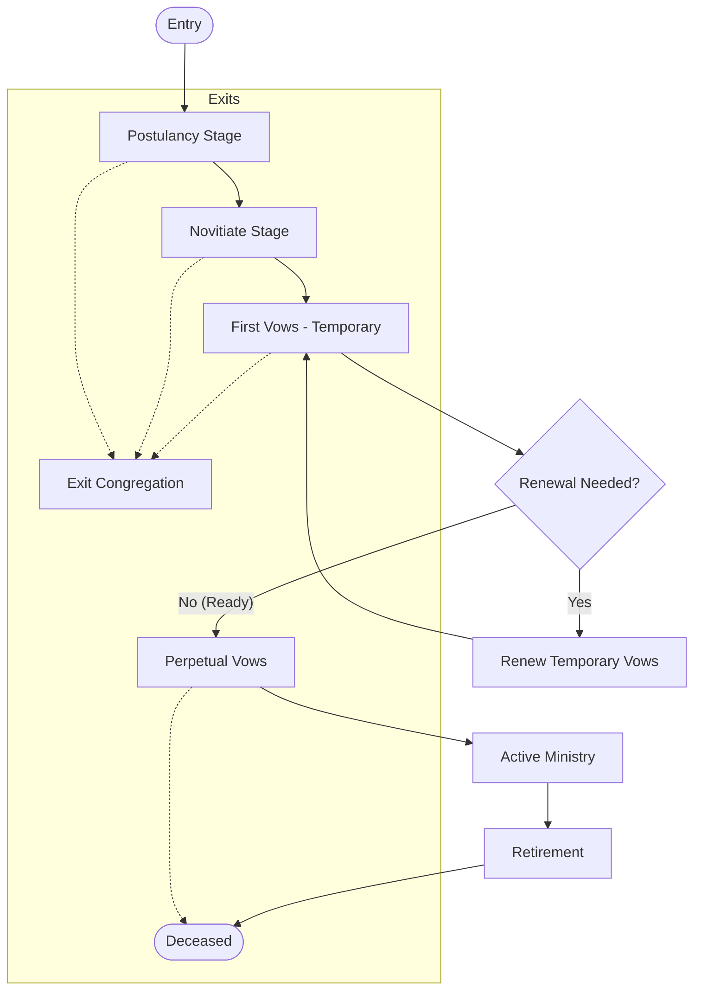
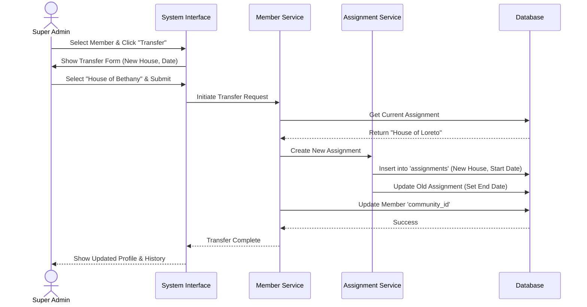
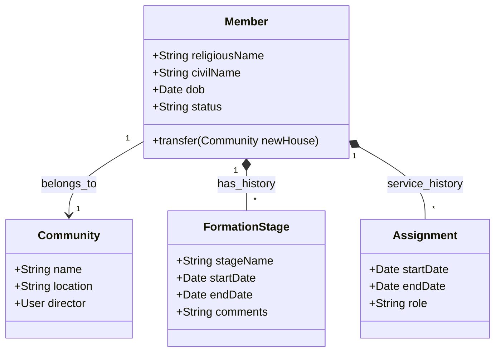
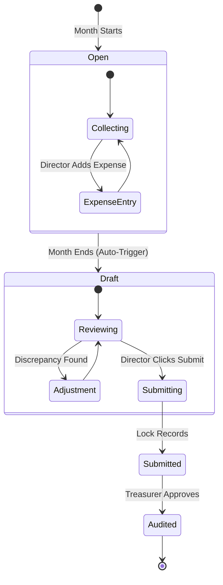
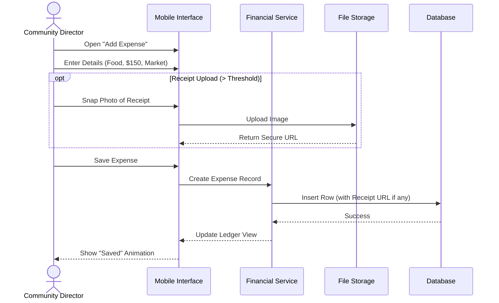
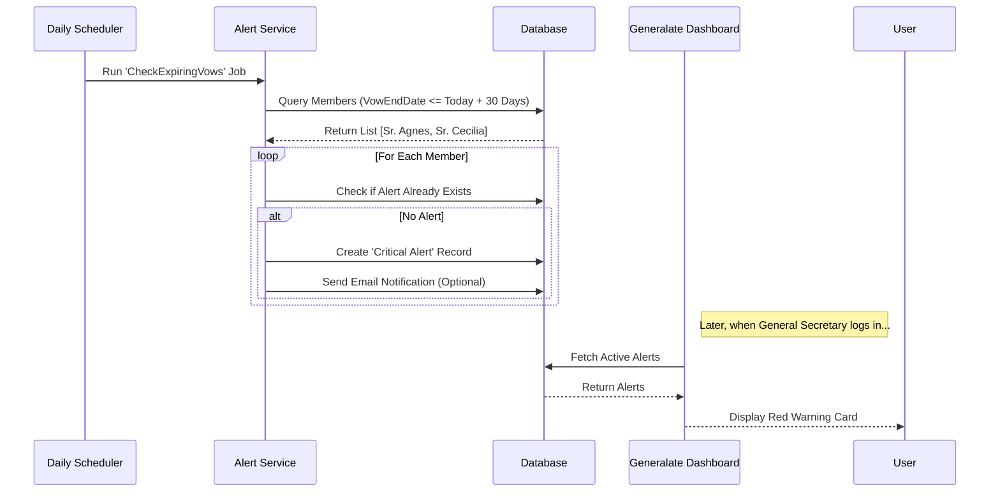

# Core System Diagrams

## 1. Member Management System

### 1.1 Member Lifecycle Flowchart

**Type:** Flowchart
**Description:** The journey of a member from entry to final vows or exit.

### 1.2 Member Transfer Sequence

**Type:** Sequence Diagram
**Description:** The process of transferring a member from one community to another.

### 1.3 Member Domain Class Diagram

**Type:** Class Diagram
**Description:** Core entities for member management.

---

## 2. Financial Stewardship System

### 2.1 Monthly Reporting Cycle

**Type:** State Diagram
**Description:** The lifecycle of a monthly financial report.

### 2.2 Expense Entry Sequence

**Type:** Sequence Diagram
**Description:** Adding an expense with an optional receipt upload.

---

## 3. Strategic Oversight System

### 3.1 Vow Expiry Alert Logic

**Type:** Sequence Diagram
**Description:** Automated background process to detect and alert on expiring vows.

