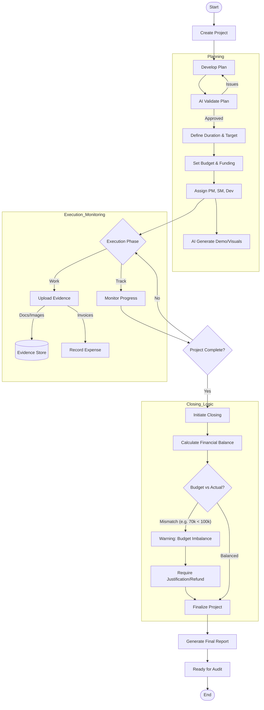
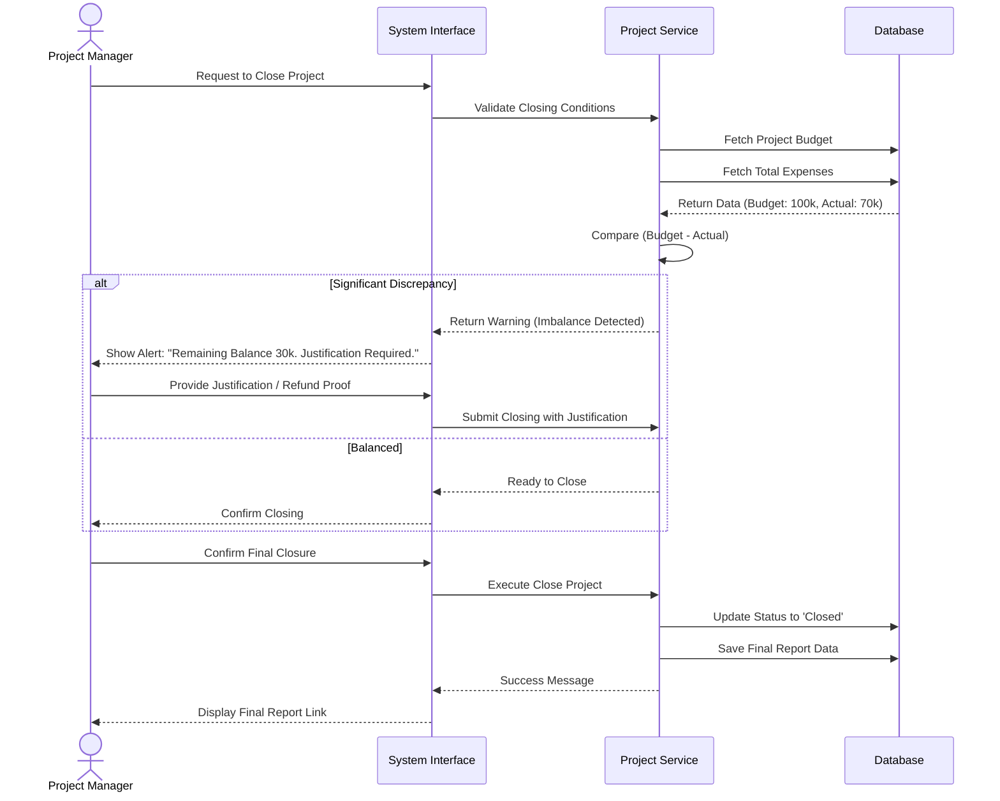
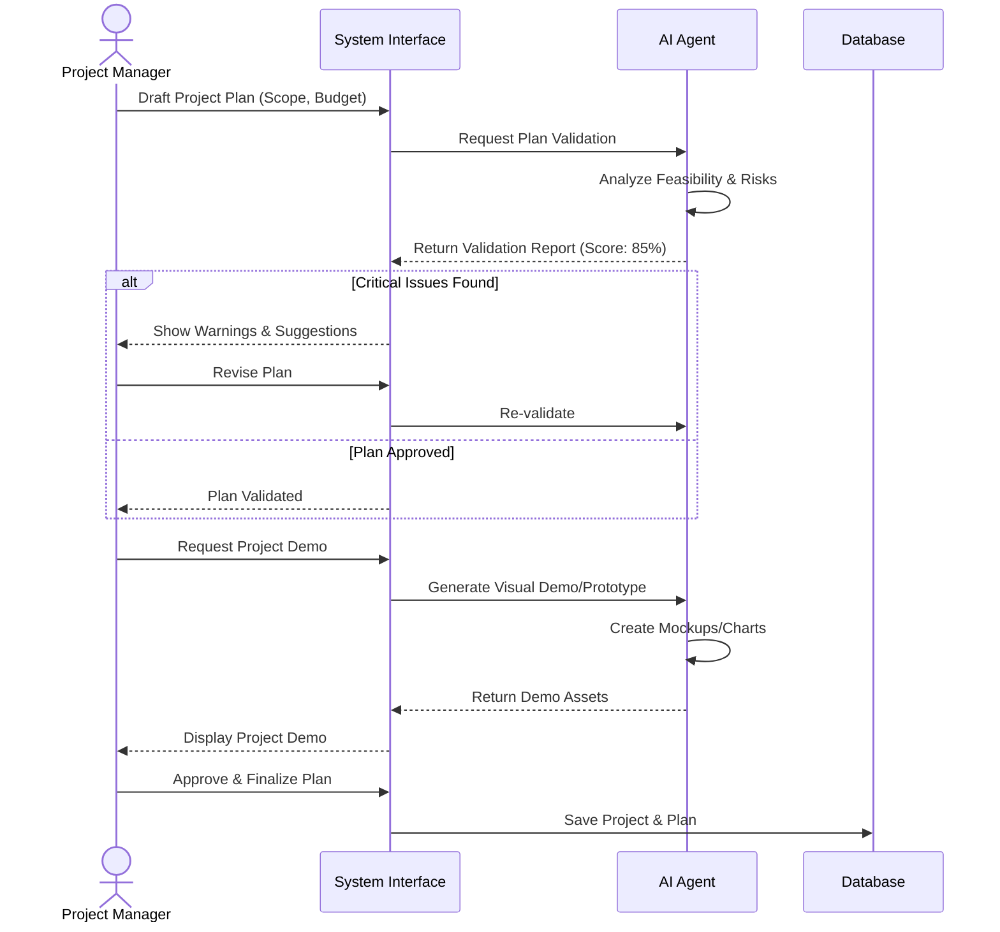
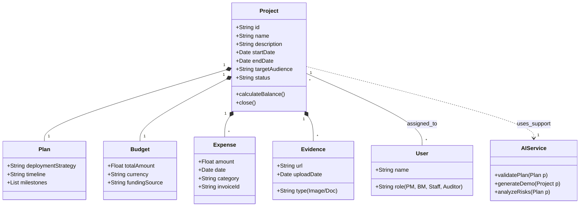
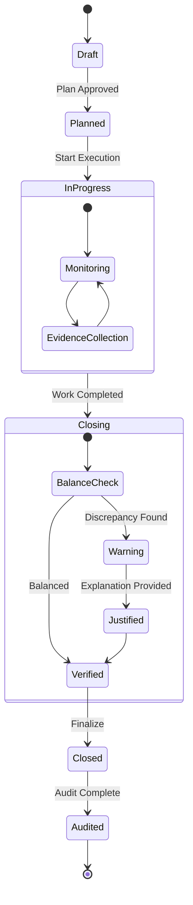

# Project Management Diagrams

## 1. Project Lifecycle Flowchart

**Type:** Flowchart
**Description:** High-level process from project creation to closing and auditing.

## 2. Project Closing Sequence

**Type:** Sequence Diagram
**Description:** Detailed interaction for the "Closing Project" feature with balance check logic.

## 3. AI-Assisted Planning Sequence

**Type:** Sequence Diagram
**Description:** AI agent assisting in plan validation and demo generation.

## 3. Project Domain Class Diagram

**Type:** Class Diagram
**Description:** Structural model of the Project Management module.

## 4. Project Status State Diagram

**Type:** State Diagram
**Description:** Lifecycle states of a project entity.

