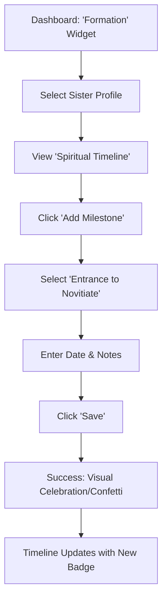

# UX Design Specification Managing the Congregation (at the organizational level)

**Author:** Wavister
**Date:** 2025-12-01

---

<!-- UX design content will be appended sequentially through collaborative workflow steps -->

## Executive Summary

### Project Vision

"Managing the Congregation" is a specialized Member Management Solution designed to modernize the administration of religious orders. It moves beyond generic HR tools to handle the unique lifecycle of religious life—from Postulancy to Perpetual Vows—centralizing data to ensure integrity, reduce administrative burden, and support "International Readiness" for congregations globally. The core goal is to digitize the "vow" and stewardship without losing the human element of care.

### Target Users

- **Community Director (e.g., Sr. Mary):** Often elderly or non-tech-savvy. Prioritizes pastoral care over paperwork. Needs an extremely simple, stress-free interface for financial reporting and member updates.
- **General Secretary (e.g., Sr. Anne):** Strategic and organized. Needs a "God's eye view" of the congregation for accurate statistics and historical preservation.
- **Formation Directress (e.g., Sr. Teresa):** Deeply empathetic. Needs a supportive system that tracks the spiritual and practical milestones of new members so she can focus on their growth.

### Key Design Challenges

- **Radical Simplicity for Low Tech-Literacy:** The interface for Community Directors must be approachable and forgiving, avoiding technical jargon.
- **International & Infrastructure Constraints:** The system must perform well on mobile devices and slower networks (e.g., in Africa).
- **Balancing "Corporate" Efficiency with "Spiritual" Care:** The design aesthetic and language must respect the religious context.

### Design Opportunities

- **Visual Timelines for Formation:** Rich, visual timelines to represent a sister's journey.
- **"Peace of Mind" Dashboard:** Proactively highlight what _needs attention_ (alerts, upcoming feast days).
- **Context-Aware Simplicity:** Role-based design to hide complexity for local users.

## Core User Experience

### Defining Experience

The core experience is defined by **"Pastoral Efficiency"**—removing the anxiety of administration so sisters can focus on their spiritual mission. The system acts as a quiet, reliable assistant that handles the complexity of canon law and accounting in the background, presenting only what is necessary for decision-making and compliance.

### Platform Strategy

- **Primary Platform:** Responsive Web Application (optimized for mobile browsers).
- **Device Context:**
  - **Community Directors:** Often shared community laptops or older smartphones.
  - **Generalate:** Desktop/Laptop for deep analysis.
- **Constraints:** Must function reliably on slow/intermittent internet connections (offline-tolerant forms for expense entry).

### Effortless Interactions

- **"One-Click" Reporting:** The monthly financial report generation must be a single button press, with no complex configuration required.
- **Natural Language Dates:** Inputting dates (e.g., "Feast of St. Joseph") should be supported or easily selectable, rather than just rigid calendar pickers.
- **Smart Defaults:** Expense categories should default based on previous entries or common usage.

### Critical Success Moments

- **The "Submit" Relief:** The moment Sr. Mary clicks "Submit Report" and sees a "Success" confirmation, knowing her duty is done.
- **The "Safe" Alert:** When Sr. Teresa receives a proactive reminder about a vow renewal _before_ it becomes a crisis.
- **The "Truth" View:** When Sr. Anne sees the exact same numbers as the Community Director, eliminating the need for "double-checking" phone calls.

### Experience Principles

1.  **Don't Make Me Think (About Tech):** Hide database IDs, error codes, and complex settings. Speak the language of the congregation.
2.  **Forgiving by Design:** Allow easy undoing of actions. Never let a user feel "trapped" or afraid they broke something.
3.  **Visuals Over Text:** Use timelines, color-coded status (Green/Yellow/Red), and icons to convey status instantly.
4.  **Respect the Context:** The interface should feel calm and respectful, avoiding "flashy" or "gamified" elements that feel out of place in religious life.

## Desired Emotional Response

### Primary Emotional Goals

- **Pastoral Peace of Mind:** The overwhelming feeling should be one of _relief_ and _support_. The system is not a taskmaster; it is a steward that helps the sisters fulfill their duties.
- **Competence & Confidence:** Sr. Mary (non-tech-savvy) should feel _capable_ and _smart_ when using the system, never confused or stupid.
- **Trust:** Sr. Anne (General Secretary) must feel absolute _trust_ in the data's accuracy.

### Emotional Journey Mapping

- **Login:** _Welcoming & Calm._ A "Good Morning, Sr. Mary" message with a daily scripture or saint of the day to ground the tech in their reality.
- **During Task (e.g., Expense Entry):** _Flow & Ease._ "I can do this quickly."
- **Completion:** _Accomplishment & Relief._ "That was easier than I thought. I'm free to go pray now."
- **Receiving an Alert:** _Gratitude._ "Thank goodness the system reminded me," rather than "Oh no, I'm in trouble."

### Micro-Emotions

- **Belonging:** The system uses _their_ language (House, Province, Vows), not generic terms (Department, Region, Contract), making them feel it was built _for them_.
- **Forgiveness:** If a mistake is made, the system gently guides correction without big red error boxes, fostering a feeling of safety.

### Design Implications

- **Color Palette:** Use calming, warm tones (e.g., soft creams, muted blues/greens) rather than stark "corporate" white/blue or aggressive "alert" red.
- **Copywriting:** Use polite, encouraging language. Instead of "Invalid Input," use "Please check the date."
- **Feedback:** Provide immediate, positive reinforcement for completed tasks (e.g., a subtle checkmark animation).

### Emotional Design Principles

1.  **Technology as Servant, not Master:** The UI should recede, highlighting the _people_ (sisters) and the _mission_.
2.  **Kindness in Code:** Error states and empty states should be written with kindness and empathy.
3.  **Celebrate the Lifecycle:** Acknowledge important spiritual milestones (Feast Days, Jubilees) with small visual celebrations to humanize the database.

## UX Pattern Analysis & Inspiration

### Inspiring Products Analysis

- **WhatsApp:** chosen for its **ubiquity and offline tolerance**. It teaches us that a simple list view with clear status indicators (ticks) is often better than a complex grid.
- **Duolingo:** chosen for its **encouraging tone**. It proves that administrative tasks (like daily practice/reporting) can be sustained through positive reinforcement rather than punishment.
- **Apple Health:** chosen for its **data clarity**. It demonstrates how to present "lifecycle" data (health/formation) in a way that feels private, secure, and easy to read.

### Transferable UX Patterns

- **"Message-Style" Lists:** Presenting expenses or members as simple cards in a vertical list (like a chat history) rather than a dense Excel-like table.
- **Offline-First Forms:** Allowing data entry (expenses) even without a connection, syncing silently when online (critical for African context).
- **The "Daily Streak":** Adapting the concept of a "streak" to encourage daily expense entry (e.g., "7 days of perfect records!").

### Anti-Patterns to Avoid

- **The "Mega-Dashboard" (e.g., Salesforce):** Avoid dashboards with 20+ widgets. Sr. Mary only needs to see 3 things: Balance, Alerts, and "Submit Report" button.
- **Hidden Navigation:** Avoid nesting critical features inside "hamburger" menus. Use a simple bottom navigation bar (mobile style) or visible side rail.
- **Cryptic Error Codes:** Never show "Error 500" or "Database Exception." Always say "We couldn't save that right now, please try again."

### Design Inspiration Strategy

- **Adopt:** WhatsApp's list interactions (swipe to delete/edit) and Apple Health's "Summary Card" aesthetic for the dashboard.
- **Adapt:** Duolingo's progress tracking—make it more "solemn" but keep the _encouragement_ for Formation tracking.
- **Avoid:** Any interaction that requires a right-click or hover (doesn't work on mobile/touch).

## Design System Foundation

### 1.1 Design System Choice

**Tailwind CSS + Headless UI (or Tailwind UI)**

### Rationale for Selection

- **Technical Alignment:** Native fit for the Laravel/Blade stack.
- **Accessibility:** Headless UI handles complex ARIA attributes (for screen readers) automatically, crucial for our older user base.
- **Mobile-First:** Tailwind's utility-first approach ensures the "International Readiness" (mobile responsiveness) is baked in, not an afterthought.

### Implementation Approach

- Use **Blade Components** (`<x-button>`, `<x-card>`) to wrap Tailwind classes. This keeps the HTML clean and ensures that if we change the "Button" style, it updates everywhere.

### Customization Strategy

- **Typography:** Use a highly readable serif for headings (e.g., _Merriweather_) to convey "tradition/warmth" and a clean sans-serif (e.g., _Inter_) for UI text.
- **Color:** Override default Tailwind colors with a custom "Congregation Palette" (Warm Creams, Deep Blues, Muted Golds).

## 2. Core User Experience

### 2.1 Defining Experience

**The "Stress-Free" Monthly Close.**
Transforming a dreaded 4-hour accounting task into a 5-minute "review and click" moment. The system aggregates daily entries automatically, so the "End of Month" is just a confirmation, not a creation event.

### 2.2 User Mental Model

- **Current Model:** "I have to gather receipts, do math, and fill out a scary spreadsheet."
- **New Model:** "I just tell the system what I spent each day (like a diary), and at the end of the month, I just say 'Amen' (Submit)."

### 2.3 Success Criteria

- **Speed:** The "Submit" flow must take < 2 minutes if daily entries were made.
- **Confidence:** The user must never fear they "broke the math." The system guarantees the totals.
- **Feedback:** Immediate confirmation that the report was _received_ by the Generalate (removing the "Did they get it?" worry).

### 2.4 Novel UX Patterns

- **"The Digital Ledger":** We use a visual metaphor of a simple daily ledger (Day/Item/Cost) rather than a complex accounting grid. It looks like a notebook.
- **"Silent Sync":** Expenses entered offline (in a remote village) sync automatically when the device hits Wi-Fi, without asking the user to "Retry."

### 2.5 Experience Mechanics

1.  **Initiation:** Automatic "End of Month" card appears on the Dashboard on the 28th.
2.  **Interaction:** User reviews the "Draft Report" (read-only summary). Can click "Edit" on a line item if needed.
3.  **Feedback:** Real-time validation ("Balance matches Cash on Hand?").
4.  **Completion:** "Submit" button triggers a PDF generation (for her records) and a database lock (for the Treasurer).
5.  **Deep Linking:** Notifications link _directly_ to the item (e.g., "Sr. Mary's Report"), not just the dashboard.

## Responsive Design & Accessibility

### Responsive Strategy

- **Mobile-First:** Design starts at 360px width.
- **Tablet (768px+):** Activates "Master-Detail" views (List + Details side-by-side).
- **Desktop (1024px+):** Activates Sidebar navigation and 3-column dashboards.

### Accessibility Strategy (Senior-Focused)

- **Compliance:** WCAG 2.1 Level AA (Targeting AAA for contrast).
- **Typography:** Base size 18px / Line-height 1.6.
- **Touch:** Minimum target size 48x48px (Apple recommends 44px; we go bigger).
- **Motion:** "Reduce Motion" support is critical (avoid vertigo-inducing transitions).

### Testing Strategy

- **Device Lab:** Test on low-end Android devices (common in mission fields).
- **Environment:** "Sunlight Test" for contrast visibility.
- **Assistive Tech:** Verify with NVDA (Windows) and VoiceOver (iOS).

## Visual Design Foundation

### Color System

- **Palette Name:** Sanctuary & Stone
- **Primary:** Deep Slate Blue (Trust)
- **Background:** Warm Stone/Cream (Paper-like, reduces eye strain)
- **Accent:** Muted Gold (Celebration)
- **Semantic:** Emerald (Good), Rose (Attention), Amber (Pending)

### Typography System

- **Headings:** _Merriweather_ (Google Fonts) - Serif, Traditional.
- **Body:** _Inter_ (Google Fonts) - Sans-serif, High Legibility.
- **Scale:** Base 16px. H1 32px, H2 24px.

### Spacing & Layout Foundation

- **Density:** Low/Comfortable.
- **Metaphor:** "Cards on a Desk." Distinct, contained units of information.
- **Grid:** Simple single-column (mobile) to 3-column (desktop) responsive grid.

### Accessibility Considerations

- **Contrast:** All text must meet WCAG AA (4.5:1 ratio).
- **Focus States:** High-visibility focus rings for keyboard navigation (Sr. Mary might prefer tabbing).
- **Touch Targets:** All buttons/links must be at least 44x44px for easy tapping.

## Design Direction Decision

### Design Directions Explored

- **Direction A (The Daily Ledger):** Focused on high-contrast clarity and task efficiency. Mimics a physical notebook. Best for financial tasks.
- **Direction B (The Pastoral Dashboard):** Focused on community overview, warmth, and people. Highlights feast days and alerts. Best for the main dashboard.

### Chosen Direction

**Hybrid Approach:** Combining the best of both worlds.

### Design Rationale

- **Context-Switching:** Users have different mindsets for different tasks. When checking the "Home" screen, they want to feel connected to the community (Direction B). When entering expenses, they want to be efficient and accurate (Direction A).
- **Emotional Balance:** The "Pastoral" home screen provides the "Peace of Mind" and "Belonging" emotional goals, while the "Ledger" financial screen provides the "Competence" and "Trust" goals.

### Implementation Approach

- **Dashboard:** Use the "Pastoral" layout with soft cards, "Upcoming Feasts" timeline, and status summaries.
- **Financials Module:** Use the "Ledger" layout with high-contrast numbers, clear list views, and the "Notebook" metaphor.

## User Journey Flows

### Sr. Mary: The Monthly Financial Close

**Goal:** Submit the monthly financial report to the Generalate with zero anxiety.
**Design Pattern:** "The Digital Ledger" (High Clarity)

```mermaid
graph TD
    A[Trigger: 'End of Month' Notification] --> B{Open Financials Tab}
    B --> C[View 'Draft Report' <br/>(Auto-aggregated from daily entries)]
    C --> D{Does Cash-in-Hand match System?}
    D -- Yes --> E[Click 'Confirm & Submit']
    D -- No --> F[Click 'Adjust Balance']
    F --> G[Enter Actual Cash Amount]
    G --> H[System creates 'Adjustment Entry']
    H --> C
    E --> I[Success: 'Thank You' Animation]
    I --> J[PDF Generated for Local Records]
```

### Sr. Teresa: Updating a Formation Stage

**Goal:** Move a sister from "Postulancy" to "Novitiate" and record the date.
**Design Pattern:** "Pastoral Dashboard" (Warmth & Celebration)



### Sr. Anne: Global Health Check

**Goal:** Quickly identify which of the 50 communities need help.
**Design Pattern:** "Exception Reporting" (Efficiency)

```mermaid
graph TD
    A[Global Dashboard] --> B[View Map Overview]
    B --> C{Filter by Status}
    C --> D[Select 'Needs Attention' (Red)]
    D --> E[List of 3 Communities appears]
    E --> F[Click 'St. Joseph House']
    F --> G[View Monthly Report Details]
    G --> H[Click 'Send Message' to Sr. Mary]
```

### Flow Optimization Principles

- **The "Review, Don't Type" Rule:** Whenever possible (like the Monthly Report), pre-fill data so the user only has to _verify_, not _enter_.
- **Forgiving Math:** If numbers don't match, never block the user. Allow an "Adjustment Entry" so they can finish their work and go to prayer.
  -\* **Celebratory Milestones:** Use animation and warm colors when recording spiritual growth events to distinguish them from administrative tasks.

## Component Strategy

### Design System Components (Tailwind UI / Headless UI)

- **Navigation:** Bottom Tab Bar (Mobile), Sidebar (Desktop).
- **Forms:** Floating Label Inputs (easier for older eyes).
- **Overlays:** Simple centered Modals for confirmations.

### Custom Components

#### 1. The Ledger Row (`<x-ledger-row>`)

- **Purpose:** Display a single expense entry with "Notebook" clarity.
- **Anatomy:** Date Badge (Left), Description (Center), Amount (Right, Bold).
- **Interaction:** Swipe Left to Delete, Tap to Edit.
- **Accessibility:** High contrast numbers, full-row touch target.

#### 2. The Feast Timeline (`<x-feast-timeline>`)

- **Purpose:** Visualize the liturgical year and community milestones.
- **Anatomy:** Horizontal scroll container, Circular Date Nodes, Gold "Feast" markers.
- **States:** Past (Dimmed), Today (Highlighted/Gold), Future (Standard).

#### 3. The Pastoral Status Card (`<x-status-card>`)

- **Purpose:** Summarize health/status without "System Alert" anxiety.
- **Anatomy:** Icon (Top Left), Big Number/Title (Center), Soft Background Color.
- **Variants:** "Peace" (Cream/Emerald), "Attention" (Rose/White).

### Implementation Roadmap

- **Phase 1 (Core):** Ledger Row & Status Card (Essential for MVP Financials).
- **Phase 2 (Pastoral):** Feast Timeline (For the Dashboard "Delight").
- **Phase 3 (Admin):** Data Tables for Sr. Anne (Standard Tailwind Tables).
