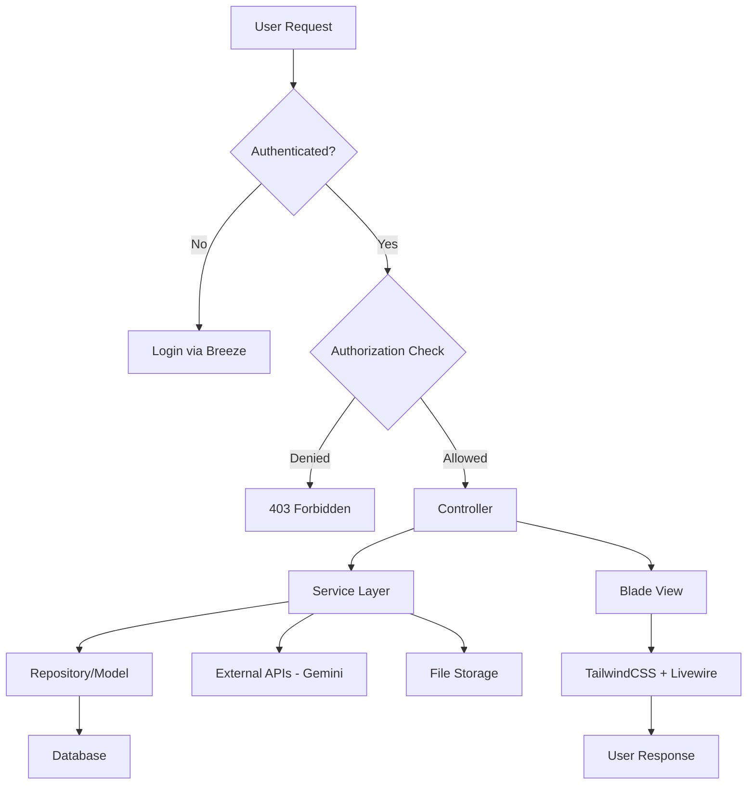
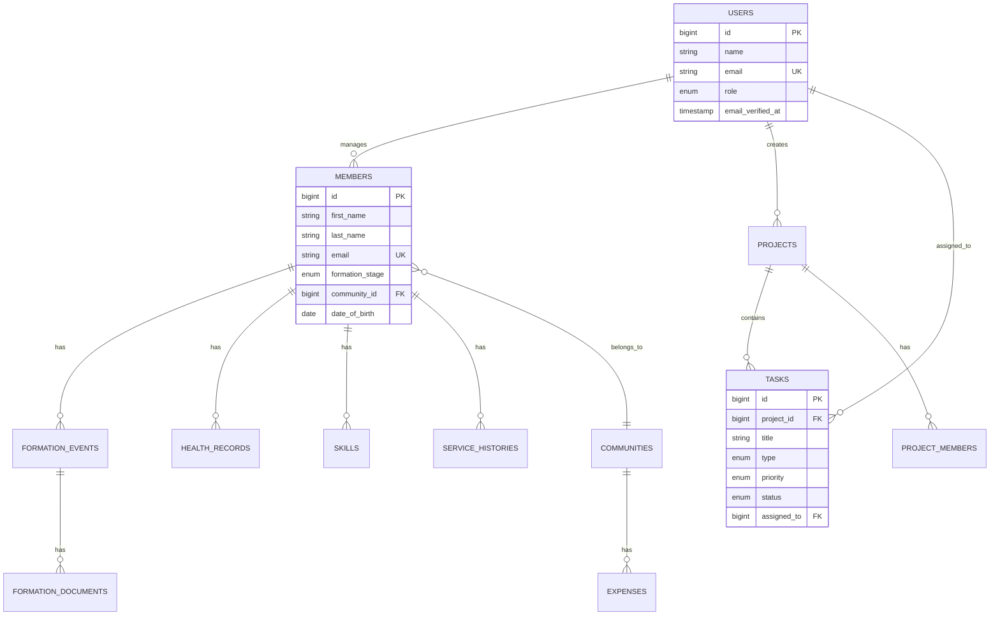

# Developer Guide

> **Comprehensive technical documentation for developers working on the Managing the Congregation (MTC) Laravel 11 application.**

---

## 📌 1. Project Overview

### Purpose

**Managing the Congregation (MTC)** is a specialized ERP system designed for religious congregations to manage:

-   **Member lifecycle** (formation stages, vows, assignments)
-   **Financial stewardship** (expenses, reports, period locking)
-   **Community governance** (houses, transfers, roles)
-   **Project & grant management** (AI-powered planning with Gemini)
-   **Reports & analytics** (demographics, critical alerts)

### Business Goals

-   Streamline administrative workflows for religious orders
-   Ensure data integrity and privacy for sensitive sacramental records
-   Provide offline-tolerant solutions for missions in Africa
-   Enable strategic oversight for Generalate leadership

### Key Modules

| Module                   | Description                                     |
| ------------------------ | ----------------------------------------------- |
| **Authentication**       | Laravel Breeze with session-based auth          |
| **Member Management**    | Profiles, formation timeline, documents, photos |
| **Financial Management** | Expense tracking, receipt uploads, PDF reports  |
| **Community Management** | Houses, transfers, assignments                  |
| **Project Management**   | AI-powered project planning with Gemini API     |
| **RBAC**                 | Type-safe permissions with super admin bypass   |
| **Audit Logging**        | Comprehensive activity tracking                 |
| **Reports**              | Demographics, financials, critical alerts       |

### Tech Stack

| Layer                | Technology                        |
| -------------------- | --------------------------------- |
| **Backend**          | Laravel 11.x (PHP 8.2+)           |
| **Database**         | MySQL 8.0                         |
| **Frontend**         | Blade Templates + TailwindCSS 3.x |
| **Reactivity**       | Livewire 3.x                      |
| **Build Tool**       | Vite (with HMR)                   |
| **Containerization** | Docker + Laravel Sail             |
| **Testing**          | Pest/PHPUnit (373 tests)          |
| **PDF Generation**   | DomPDF                            |
| **Image Processing** | Intervention Image                |
| **AI Integration**   | Google Gemini 2.5 Flash API       |
| **Static Analysis**  | PHPStan, Larastan                 |
| **Code Style**       | Laravel Pint (PSR-12)             |

### Application Flow



---

## 🧱 2. Local Development Setup (Docker + Laravel)

### System Requirements

-   **Docker Desktop** (latest version)
-   **PHP 8.2+** (for local Composer commands)
-   **Composer** 2.x
-   **Node.js** 20+ and npm
-   **Git** (latest)
-   **4GB+ RAM** available for containers
-   **10GB+ free disk space**

### Step-by-Step Setup

#### 1. Clone the Repository

```bash
git clone https://github.com/n0bcode/CongregationManagement.git
cd System_Blood_Group/managing-congregation
```

#### 2. Environment Configuration

```bash
# Copy environment file
cp .env.example .env

# Edit .env and configure:
# - DB_DATABASE, DB_USERNAME, DB_PASSWORD
# - GEMINI_API_KEY (for AI features)
# - APP_URL (http://localhost for local dev)
```

#### 3. Start Docker Containers

```bash
# Start all services (Laravel, MySQL, Mailpit)
./vendor/bin/sail up -d

# Alternative: Use alias for convenience
alias sail='./vendor/bin/sail'
sail up -d
```

#### 4. Install Dependencies

```bash
# Install PHP dependencies
sail composer install

# Install Node dependencies
sail npm install
```

#### 5. Application Setup

```bash
# Generate application key
sail artisan key:generate

# Run migrations and seed database
sail artisan migrate --seed

# Create storage symlink
sail artisan storage:link
```

#### 6. Start Development Servers

```bash
# Start Vite development server with HMR
sail npm run dev

# In another terminal, optionally start queue worker
sail artisan queue:work
```

#### 7. Access the Application

-   **Main App**: [http://localhost](http://localhost)
-   **Mailpit (Email Testing)**: [http://localhost:8025](http://localhost:8025)

### Docker Compose Architecture

The `compose.yaml` defines three services:

#### `laravel.test` (Main Application)

-   **Image**: `sail-8.4/app` (PHP 8.4)
-   **Ports**:
    -   `80:8000` (Laravel)
    -   `5173:5173` (Vite HMR)
-   **Command**: `php artisan serve --host=0.0.0.0 --port=8000`
-   **Volumes**: `.:/var/www/html` (bind mount for live code changes)

#### `mysql` (Database)

-   **Image**: `mysql/mysql-server:8.0`
-   **Port**: `3306:3306`
-   **Volume**: `sail-mysql` (persistent data)
-   **Auto-creates testing database** via init script

#### `mailpit` (Email Testing)

-   **Image**: `axllent/mailpit:latest`
-   **Ports**:
    -   `1025` (SMTP)
    -   `8025` (Web UI)

### Useful Sail Commands

```bash
# Container management
sail up -d                    # Start containers in background
sail down                     # Stop containers
sail ps                       # View container status
sail shell                    # Access app container shell

# Artisan commands
sail artisan migrate
sail artisan test
sail artisan tinker

# Composer
sail composer require vendor/package
sail composer update

# NPM
sail npm install
sail npm run build
sail npm run dev

# Database
sail mysql                    # Connect to MySQL CLI
sail artisan db:seed

# Logs
sail logs                     # View all logs
sail logs laravel.test        # View app logs
```

---

## 📂 3. Project Structure (Laravel Codebase)

### Directory Overview

```
managing-congregation/
├── app/
│   ├── Console/Commands/         # Custom Artisan commands
│   ├── Enums/                    # Type-safe enums (UserRole, PermissionKey, etc.)
│   ├── Exceptions/               # Custom exception handlers
│   ├── Helpers/                  # Helper functions
│   ├── Http/
│   │   ├── Controllers/          # HTTP Controllers (thin)
│   │   ├── Middleware/           # Custom middleware
│   │   └── Requests/             # FormRequest validation classes
│   ├── Livewire/                 # Livewire components
│   ├── Mail/                     # Mailable classes
│   ├── Models/                   # Eloquent models
│   ├── Observers/                # Model observers
│   ├── Policies/                 # Authorization policies
│   ├── Services/                 # Business logic layer ⭐
│   ├── ValueObjects/             # Domain value objects
│   └── View/Components/          # Blade components
├── bootstrap/
├── config/                       # Configuration files
├── database/
│   ├── factories/                # Model factories for testing
│   ├── migrations/               # Database migrations
│   └── seeders/                  # Database seeders
├── docker/8.4/                   # Docker build context
├── docs/                         # Project documentation
├── public/                       # Web root (index.php, assets)
├── resources/
│   ├── css/                      # TailwindCSS source
│   ├── js/                       # JavaScript (Vite entry)
│   └── views/                    # Blade templates
├── routes/
│   ├── web.php                   # Web routes ⭐
│   ├── api.php                   # API routes
│   └── auth.php                  # Authentication routes (Breeze)
├── storage/
│   ├── app/private/              # Secure file storage
│   ├── framework/                # Cache, sessions, views
│   └── logs/                     # Application logs
├── tests/
│   ├── Feature/                  # Feature tests
│   └── Unit/                     # Unit tests
├── compose.yaml                  # Docker Compose configuration
├── phpunit.xml                   # PHPUnit configuration
├── phpstan.neon                  # PHPStan configuration
└── tailwind.config.js            # TailwindCSS configuration
```

### Architectural Pattern: Thin Controllers → Services → Models

#### ✅ **Correct Pattern**

```php
// Controller (Thin - only handles HTTP concerns)
class MemberController extends Controller
{
    public function __construct(
        private MemberService $memberService
    ) {}

    public function store(StoreMemberRequest $request)
    {
        $member = $this->memberService->createMember($request->validated());

        return redirect()
            ->route('members.show', $member)
            ->with('success', 'Member created successfully');
    }
}

// Service (Business Logic)
class MemberService
{
    public function createMember(array $data): Member
    {
        DB::beginTransaction();

        try {
            $member = Member::create($data);

            // Complex business logic
            if ($data['formation_stage'] === 'postulancy') {
                $this->formationService->initializeFormation($member);
            }

            AuditLogger::log('member.created', $member);

            DB::commit();
            return $member;
        } catch (\Exception $e) {
            DB::rollBack();
            throw $e;
        }
    }
}
```

#### ❌ **Anti-Pattern (Fat Controller)**

```php
// DON'T DO THIS
class MemberController extends Controller
{
    public function store(Request $request)
    {
        // Validation in controller
        $validated = $request->validate([...]);

        // Business logic in controller (BAD!)
        DB::beginTransaction();
        $member = Member::create($validated);

        if ($validated['formation_stage'] === 'postulancy') {
            FormationEvent::create([...]);
        }

        AuditLog::create([...]);
        DB::commit();

        return redirect()->route('members.show', $member);
    }
}
```

### Key Services

| Service                    | Purpose                                             |
| -------------------------- | --------------------------------------------------- |
| `GeminiProjectPlanService` | AI-powered project planning via Gemini API          |
| `FinancialService`         | Expense tracking, period locking, report generation |
| `FormationService`         | Canon Law date calculations for vows                |
| `AuditLogger`              | Comprehensive activity logging                      |
| `PermissionService`        | RBAC permission checking with super admin bypass    |
| `FileStorageService`       | Secure document upload/download                     |
| `PdfService`               | PDF generation for reports                          |
| `NotificationService`      | Email and in-app notifications                      |
| `CelebrationCardService`   | Birthday card generation with custom fonts          |

### FormRequest Validation

All user input is validated using dedicated `FormRequest` classes:

```php
// app/Http/Requests/StoreMemberRequest.php
class StoreMemberRequest extends FormRequest
{
    public function authorize(): bool
    {
        return $this->user()->can('create-members');
    }

    public function rules(): array
    {
        return [
            'first_name' => ['required', 'string', 'max:255'],
            'last_name' => ['required', 'string', 'max:255'],
            'email' => ['required', 'email', 'unique:members,email'],
            'formation_stage' => ['required', Rule::enum(FormationStage::class)],
        ];
    }
}
```

### Blade Components

Reusable UI components in `app/View/Components/`:

```blade
{{-- Usage --}}
<x-ui.button variant="primary" size="lg">
    Save Member
</x-ui.button>

<x-ui.card>
    <x-slot:header>Member Profile</x-slot:header>
    <p>Content here</p>
</x-ui.card>
```

---

## 🧪 4. API Design & Routes

### Route Structure

Routes are defined in `routes/web.php` using Laravel's resource routing and custom endpoints.

### Authentication Mechanism

-   **Session-based authentication** via Laravel Breeze
-   **Middleware**: `auth`, `verified`
-   **No API tokens** (this is a web application, not an API-first app)

### Key Route Groups

#### Member Management

```php
Route::resource('members', MemberController::class);
// GET    /members              -> index
// GET    /members/create       -> create
// POST   /members              -> store
// GET    /members/{member}     -> show
// GET    /members/{member}/edit -> edit
// PUT    /members/{member}     -> update
// DELETE /members/{member}     -> destroy

// Additional member routes
Route::post('/members/{member}/formation', [FormationController::class, 'store']);
Route::put('/members/{member}/photo', [MemberPhotoController::class, 'update']);
Route::post('/members/{member}/transfer', [MemberTransferController::class, 'store']);
```

#### Financial Management

```php
Route::resource('financials', FinancialController::class);
Route::get('/financials/dashboard', FinancialDashboard::class); // Livewire
Route::post('/financials-lock-period', [FinancialController::class, 'lockPeriod']);
Route::get('/financials-export-report', [FinancialController::class, 'exportMonthlyReport']);
```

#### Project Management (AI-Powered)

```php
Route::resource('projects', ProjectController::class);

// AI project generation
Route::get('projects/ai/create', [AIProjectController::class, 'create']);
Route::post('projects/ai/generate', [AIProjectController::class, 'generate']);
Route::post('projects/ai/store', [AIProjectController::class, 'store']);

// Task management
Route::get('projects/{project}/tasks/timeline', [TaskController::class, 'timeline']);
Route::patch('projects/{project}/tasks/{task}/dates', [ProjectController::class, 'updateTaskDates']);
```

#### Admin Routes

```php
Route::middleware('can:view-admin')->prefix('admin')->name('admin.')->group(function () {
    Route::get('/permissions', [PermissionManagementController::class, 'index']);
    Route::get('/settings', [SettingsController::class, 'index']);
    Route::get('/backups', [BackupController::class, 'index']);
});
```

### Example API Response (Internal JSON)

For AJAX requests (e.g., task status updates):

```http
PATCH /projects/1/tasks/5/status
Content-Type: application/json

{
  "status": "in_progress"
}

Response:
{
  "success": true,
  "task": {
    "id": 5,
    "title": "Setup Database",
    "status": "in_progress",
    "updated_at": "2025-12-17T04:43:52Z"
  }
}
```

---

## 🤖 5. AI Integration (Gemini API)

### Overview

The application integrates **Google Gemini 2.5 Flash** for AI-powered project planning. Users provide a project description, and Gemini generates a structured project plan with epics and tasks.

### Service: `GeminiProjectPlanService`

**Location**: `app/Services/GeminiProjectPlanService.php`

#### Configuration

```env
# .env
GEMINI_API_KEY=your_api_key_here
```

Or configure in `config/services.php`:

```php
'gemini' => [
    'key' => env('GEMINI_API_KEY'),
],
```

#### Usage Example

```php
use App\Services\GeminiProjectPlanService;

$service = new GeminiProjectPlanService();

try {
    $plan = $service->generatePlan(
        description: "Build a mobile app for task management with React Native",
        manualApiKey: null // Optional: override env key
    );

    // $plan structure:
    // [
    //     'project_name' => 'Task Management Mobile App',
    //     'description' => 'A comprehensive mobile application...',
    //     'tasks' => [
    //         ['title' => 'Phase 1: Planning', 'type' => 'epic', ...],
    //         ['title' => 'Setup React Native', 'type' => 'task', ...],
    //     ]
    // ]

} catch (\Exception $e) {
    // Handle API errors
    Log::error('Gemini API failed', ['error' => $e->getMessage()]);
}
```

#### API Settings

| Parameter           | Value                     |
| ------------------- | ------------------------- |
| **Model**           | `gemini-2.5-flash`        |
| **Temperature**     | 0.7 (balanced creativity) |
| **Top K**           | 40                        |
| **Top P**           | 0.95                      |
| **Max Tokens**      | 8192                      |
| **Response Format** | `application/json`        |

#### Prompt Template

The service uses a structured prompt to ensure consistent JSON output:

```php
private function buildSystemPrompt(string $userInput): string
{
    return <<<EOT
You are an expert Senior Project Manager. Your task is to create a comprehensive, production-ready project plan based on the user's request.

User Request: "{$userInput}"

Requirements:
1. **Structure**: Break the project down into logical **Epics** (major phases) and **Tasks**.
2. **Output Format**: Return strictly **valid JSON** only. No Markdown code fences.
3. **Schema**: The JSON must exactly match this structure:
    {
        "project_name": "Suggested Professional Name",
        "description": "Professional executive summary of the project",
        "tasks": [
            {
                "title": "Phase 1: Foundation (Header Task)",
                "type": "epic",
                "priority": "high",
                "estimated_hours": 40
            },
            {
                "title": "Setup Development Environment",
                "type": "task",
                "priority": "high",
                "status": "todo",
                "estimated_hours": 4
            }
        ]
    }

4. **Rules**:
    - `type` must be one of: "epic", "story", "task", "bug".
    - `priority` must be one of: "low", "medium", "high", "urgent".
    - `status` defaults to "todo".
    - Use "epic" type for grouping phases.
EOT;
}
```

#### Response Parsing

The service cleans and validates the AI response:

````php
private function cleanAndParseJson(string $rawContent): array
{
    // Remove Markdown code fences (Gemini sometimes adds them)
    $cleanContent = preg_replace('/^```json\s*/m', '', $rawContent);
    $cleanContent = preg_replace('/^```\s*/m', '', $cleanContent);

    $data = json_decode($cleanContent, true);

    if (json_last_error() !== JSON_ERROR_NONE) {
        throw new \Exception('AI returned invalid data format. Please try again.');
    }

    // Validate required fields
    if (!isset($data['project_name']) || !isset($data['tasks'])) {
        throw new \Exception('AI response missing required project structure.');
    }

    return $data;
}
````

#### Database Storage

After generation, the plan is saved to the database:

```php
// AIProjectController.php
public function store(Request $request)
{
    $validated = $request->validate([
        'project_name' => 'required|string|max:255',
        'description' => 'nullable|string',
        'tasks' => 'required|array',
    ]);

    DB::beginTransaction();

    try {
        $project = Project::create([
            'name' => $validated['project_name'],
            'description' => $validated['description'],
            'created_by' => auth()->id(),
        ]);

        foreach ($validated['tasks'] as $taskData) {
            Task::create([
                'project_id' => $project->id,
                'title' => $taskData['title'],
                'type' => $taskData['type'],
                'priority' => $taskData['priority'],
                'status' => $taskData['status'] ?? 'todo',
                'estimated_hours' => $taskData['estimated_hours'] ?? null,
            ]);
        }

        DB::commit();
        return redirect()->route('projects.show', $project);

    } catch (\Exception $e) {
        DB::rollBack();
        throw $e;
    }
}
```

### Modifying AI Prompts

To adjust the AI behavior:

1. **Edit the prompt template** in `GeminiProjectPlanService::buildSystemPrompt()`
2. **Adjust generation parameters** in the `generatePlan()` method:
    - Increase `temperature` for more creative outputs
    - Decrease `temperature` for more deterministic outputs
    - Adjust `maxOutputTokens` for longer/shorter responses

### Error Handling

Common errors and solutions:

| Error                                            | Cause                              | Solution                                           |
| ------------------------------------------------ | ---------------------------------- | -------------------------------------------------- |
| `Gemini API Key is not configured`               | Missing `GEMINI_API_KEY` in `.env` | Add API key to `.env` file                         |
| `Failed to communicate with AI service`          | Network/API error                  | Check API key validity, network connection         |
| `AI returned invalid data format`                | JSON parsing failed                | Review prompt template, check Gemini response logs |
| `AI response missing required project structure` | Incomplete response                | Retry generation, adjust prompt for clarity        |

---

## 🛠️ 6. Database, Migration & Seeding

### Creating Migrations

```bash
# Create a new migration
sail artisan make:migration create_tasks_table

# Create migration with model
sail artisan make:model Task -m

# Create model with migration, factory, and seeder
sail artisan make:model Task -mfs
```

### Migration Example

```php
// database/migrations/2025_12_17_000000_create_tasks_table.php
use Illuminate\Database\Migrations\Migration;
use Illuminate\Database\Schema\Blueprint;
use Illuminate\Support\Facades\Schema;

return new class extends Migration
{
    public function up(): void
    {
        Schema::create('tasks', function (Blueprint $table) {
            $table->id();
            $table->foreignId('project_id')->constrained()->cascadeOnDelete();
            $table->string('title');
            $table->text('description')->nullable();
            $table->enum('type', ['epic', 'story', 'task', 'bug'])->default('task');
            $table->enum('priority', ['low', 'medium', 'high', 'urgent'])->default('medium');
            $table->enum('status', ['todo', 'in_progress', 'done'])->default('todo');
            $table->integer('estimated_hours')->nullable();
            $table->date('start_date')->nullable();
            $table->date('due_date')->nullable();
            $table->foreignId('assigned_to')->nullable()->constrained('users');
            $table->timestamps();
            $table->softDeletes();

            $table->index(['project_id', 'status']);
        });
    }

    public function down(): void
    {
        Schema::dropIfExists('tasks');
    }
};
```

### Seeding with Factories

```php
// database/factories/TaskFactory.php
namespace Database\Factories;

use App\Models\Project;
use App\Models\User;
use Illuminate\Database\Eloquent\Factories\Factory;

class TaskFactory extends Factory
{
    public function definition(): array
    {
        return [
            'project_id' => Project::factory(),
            'title' => fake()->sentence(),
            'description' => fake()->paragraph(),
            'type' => fake()->randomElement(['epic', 'story', 'task', 'bug']),
            'priority' => fake()->randomElement(['low', 'medium', 'high', 'urgent']),
            'status' => fake()->randomElement(['todo', 'in_progress', 'done']),
            'estimated_hours' => fake()->numberBetween(1, 40),
            'start_date' => fake()->dateTimeBetween('now', '+1 week'),
            'due_date' => fake()->dateTimeBetween('+1 week', '+1 month'),
            'assigned_to' => User::factory(),
        ];
    }
}

// database/seeders/TaskSeeder.php
namespace Database\Seeders;

use App\Models\Task;
use Illuminate\Database\Seeder;

class TaskSeeder extends Seeder
{
    public function run(): void
    {
        Task::factory()->count(50)->create();
    }
}
```

### Relationship Diagram (ERD)



### Command Reference

```bash
# Run all pending migrations
sail artisan migrate

# Rollback last migration batch
sail artisan migrate:rollback

# Rollback all migrations and re-run
sail artisan migrate:fresh

# Migrate and seed
sail artisan migrate:fresh --seed

# Seed database
sail artisan db:seed

# Seed specific seeder
sail artisan db:seed --class=DemoSeeder

# Check migration status
sail artisan migrate:status
```

---

## 🚀 7. Adding New Features (Developer Workflow)

### Example: Add Notification Module

#### Step 1: Create Route

```php
// routes/web.php
Route::middleware('auth')->group(function () {
    Route::resource('notifications', NotificationController::class);
    Route::post('/notifications/{notification}/mark-read', [NotificationController::class, 'markRead'])
        ->name('notifications.mark-read');
});
```

#### Step 2: Create Controller

```bash
sail artisan make:controller NotificationController --resource
```

```php
// app/Http/Controllers/NotificationController.php
namespace App\Http\Controllers;

use App\Http\Requests\StoreNotificationRequest;
use App\Services\NotificationService;
use Illuminate\Http\Request;

class NotificationController extends Controller
{
    public function __construct(
        private NotificationService $notificationService
    ) {}

    public function index(Request $request)
    {
        $this->authorize('view-notifications');

        $notifications = $this->notificationService->getUserNotifications(
            user: $request->user(),
            perPage: 20
        );

        return view('notifications.index', compact('notifications'));
    }

    public function store(StoreNotificationRequest $request)
    {
        $notification = $this->notificationService->create($request->validated());

        return redirect()
            ->route('notifications.index')
            ->with('success', 'Notification created successfully');
    }

    public function markRead(Request $request, int $id)
    {
        $this->notificationService->markAsRead($id, $request->user());

        return response()->json(['success' => true]);
    }
}
```

#### Step 3: Create Service

```bash
sail artisan make:class Services/NotificationService
```

```php
// app/Services/NotificationService.php
namespace App\Services;

use App\Models\Notification;
use App\Models\User;
use Illuminate\Pagination\LengthAwarePaginator;

class NotificationService
{
    public function getUserNotifications(User $user, int $perPage = 20): LengthAwarePaginator
    {
        return Notification::query()
            ->where('user_id', $user->id)
            ->latest()
            ->paginate($perPage);
    }

    public function create(array $data): Notification
    {
        return Notification::create($data);
    }

    public function markAsRead(int $id, User $user): void
    {
        Notification::query()
            ->where('id', $id)
            ->where('user_id', $user->id)
            ->update(['read_at' => now()]);
    }
}
```

#### Step 4: Create Model and Migration

```bash
sail artisan make:model Notification -m
```

```php
// app/Models/Notification.php
namespace App\Models;

use Illuminate\Database\Eloquent\Model;
use Illuminate\Database\Eloquent\Relations\BelongsTo;

class Notification extends Model
{
    protected $fillable = [
        'user_id',
        'title',
        'message',
        'type',
        'read_at',
    ];

    protected $casts = [
        'read_at' => 'datetime',
    ];

    public function user(): BelongsTo
    {
        return $this->belongsTo(User::class);
    }

    public function isRead(): bool
    {
        return $this->read_at !== null;
    }
}
```

#### Step 5: Create FormRequest

```bash
sail artisan make:request StoreNotificationRequest
```

```php
// app/Http/Requests/StoreNotificationRequest.php
namespace App\Http\Requests;

use Illuminate\Foundation\Http\FormRequest;

class StoreNotificationRequest extends FormRequest
{
    public function authorize(): bool
    {
        return $this->user()->can('create-notifications');
    }

    public function rules(): array
    {
        return [
            'user_id' => ['required', 'exists:users,id'],
            'title' => ['required', 'string', 'max:255'],
            'message' => ['required', 'string'],
            'type' => ['required', 'in:info,warning,error,success'],
        ];
    }
}
```

#### Step 6: Create Blade View

```blade
{{-- resources/views/notifications/index.blade.php --}}
<x-app-layout>
    <x-slot:header>
        <h2 class="font-semibold text-xl text-gray-800 leading-tight">
            Notifications
        </h2>
    </x-slot:header>

    <div class="py-12">
        <div class="max-w-7xl mx-auto sm:px-6 lg:px-8">
            <div class="bg-white overflow-hidden shadow-sm sm:rounded-lg">
                <div class="p-6">
                    @foreach($notifications as $notification)
                        <div class="mb-4 p-4 border rounded {{ $notification->isRead() ? 'bg-gray-50' : 'bg-blue-50' }}">
                            <h3 class="font-bold">{{ $notification->title }}</h3>
                            <p class="text-gray-700">{{ $notification->message }}</p>
                            <span class="text-xs text-gray-500">{{ $notification->created_at->diffForHumans() }}</span>

                            @unless($notification->isRead())
                                <button
                                    onclick="markAsRead({{ $notification->id }})"
                                    class="ml-4 text-blue-600 hover:underline"
                                >
                                    Mark as read
                                </button>
                            @endunless
                        </div>
                    @endforeach

                    {{ $notifications->links() }}
                </div>
            </div>
        </div>
    </div>

    <script>
        function markAsRead(id) {
            fetch(`/notifications/${id}/mark-read`, {
                method: 'POST',
                headers: {
                    'X-CSRF-TOKEN': '{{ csrf_token() }}',
                    'Content-Type': 'application/json',
                }
            })
            .then(response => response.json())
            .then(() => window.location.reload());
        }
    </script>
</x-app-layout>
```

#### Step 7: Write Tests

```bash
sail artisan make:test NotificationTest
```

```php
// tests/Feature/NotificationTest.php
namespace Tests\Feature;

use App\Models\Notification;
use App\Models\User;
use Tests\TestCase;

class NotificationTest extends TestCase
{
    public function test_user_can_view_their_notifications(): void
    {
        $user = User::factory()->create();
        Notification::factory()->count(3)->create(['user_id' => $user->id]);

        $response = $this->actingAs($user)->get(route('notifications.index'));

        $response->assertOk();
        $response->assertViewHas('notifications');
    }

    public function test_user_can_mark_notification_as_read(): void
    {
        $user = User::factory()->create();
        $notification = Notification::factory()->create(['user_id' => $user->id, 'read_at' => null]);

        $response = $this->actingAs($user)
            ->post(route('notifications.mark-read', $notification));

        $response->assertOk();
        $this->assertNotNull($notification->fresh()->read_at);
    }
}
```

### Naming Conventions

| Type            | Convention                      | Example                         |
| --------------- | ------------------------------- | ------------------------------- |
| **Controller**  | `{Resource}Controller`          | `NotificationController`        |
| **Service**     | `{Resource}Service`             | `NotificationService`           |
| **Model**       | Singular, PascalCase            | `Notification`                  |
| **Migration**   | `{action}_{table}_table`        | `create_notifications_table`    |
| **FormRequest** | `{Action}{Resource}Request`     | `StoreNotificationRequest`      |
| **Route Name**  | `{resource}.{action}`           | `notifications.index`           |
| **View**        | `{resource}/{action}.blade.php` | `notifications/index.blade.php` |

---

## ✅ 8. Testing (Pest, PHPUnit)

### Test Structure

```
tests/
├── Feature/               # Feature tests (HTTP, integration)
│   ├── Auth/
│   ├── Members/
│   ├── Financials/
│   └── Projects/
└── Unit/                  # Unit tests (isolated logic)
    ├── Services/
    ├── Models/
    └── Helpers/
```

### Running Tests

```bash
# Run all tests
sail artisan test

# Run specific test file
sail artisan test tests/Feature/NotificationTest.php

# Run tests with coverage (requires Xdebug)
sail artisan test --coverage

# Run tests in parallel
sail artisan test --parallel

# Run tests with verbose output
sail artisan test --verbose

# Filter tests by name
sail artisan test --filter=test_user_can_view_notifications
```

### Feature Test Example

```php
// tests/Feature/MemberTest.php
namespace Tests\Feature;

use App\Models\Member;
use App\Models\User;
use Tests\TestCase;

class MemberTest extends TestCase
{
    public function test_authenticated_user_can_view_members_list(): void
    {
        $user = User::factory()->create();
        Member::factory()->count(5)->create();

        $response = $this->actingAs($user)->get(route('members.index'));

        $response->assertOk();
        $response->assertViewIs('members.index');
        $response->assertViewHas('members');
    }

    public function test_user_can_create_member_with_valid_data(): void
    {
        $user = User::factory()->create();

        $data = [
            'first_name' => 'John',
            'last_name' => 'Doe',
            'email' => 'john.doe@example.com',
            'formation_stage' => 'postulancy',
        ];

        $response = $this->actingAs($user)
            ->post(route('members.store'), $data);

        $response->assertRedirect();
        $this->assertDatabaseHas('members', ['email' => 'john.doe@example.com']);
    }

    public function test_member_creation_fails_with_invalid_email(): void
    {
        $user = User::factory()->create();

        $data = [
            'first_name' => 'John',
            'last_name' => 'Doe',
            'email' => 'invalid-email',
            'formation_stage' => 'postulancy',
        ];

        $response = $this->actingAs($user)
            ->post(route('members.store'), $data);

        $response->assertSessionHasErrors('email');
    }
}
```

### Unit Test Example

```php
// tests/Unit/Services/FormationServiceTest.php
namespace Tests\Unit\Services;

use App\Services\FormationService;
use Carbon\Carbon;
use Tests\TestCase;

class FormationServiceTest extends TestCase
{
    private FormationService $service;

    protected function setUp(): void
    {
        parent::setUp();
        $this->service = new FormationService();
    }

    public function test_calculates_first_vows_date_correctly(): void
    {
        $noviceDate = Carbon::parse('2023-01-01');

        $firstVowsDate = $this->service->calculateFirstVowsDate($noviceDate);

        $this->assertEquals('2024-01-01', $firstVowsDate->toDateString());
    }

    public function test_validates_canon_law_requirements(): void
    {
        $noviceDate = Carbon::parse('2023-01-01');
        $firstVowsDate = Carbon::parse('2023-06-01'); // Too soon

        $isValid = $this->service->validateCanonLawPeriod($noviceDate, $firstVowsDate);

        $this->assertFalse($isValid);
    }
}
```

### Testing Best Practices

1. **Arrange-Act-Assert Pattern**

    ```php
    public function test_example(): void
    {
        // Arrange: Set up test data
        $user = User::factory()->create();

        // Act: Perform the action
        $response = $this->actingAs($user)->get('/dashboard');

        // Assert: Verify the outcome
        $response->assertOk();
    }
    ```

2. **Use Factories for Test Data**

    ```php
    $members = Member::factory()->count(10)->create();
    ```

3. **Test Validation Rules**

    ```php
    $response = $this->post('/members', ['email' => 'invalid']);
    $response->assertSessionHasErrors('email');
    ```

4. **Test Authorization**

    ```php
    $user = User::factory()->create(['role' => 'member']);
    $response = $this->actingAs($user)->get('/admin/settings');
    $response->assertForbidden();
    ```

5. **Test Database Interactions**
    ```php
    $this->assertDatabaseHas('members', ['email' => 'test@example.com']);
    $this->assertDatabaseMissing('members', ['id' => 999]);
    ```

### Code Coverage

```bash
# Generate coverage report (requires Xdebug)
sail artisan test --coverage --min=80

# Generate HTML coverage report
sail artisan test --coverage-html coverage/
```

---

## ⚙️ 9. CI/CD Pipeline

> **Note**: This project does not currently have a CI/CD pipeline configured. Below is a recommended setup for GitHub Actions.

### Recommended GitHub Actions Workflow

Create `.github/workflows/laravel.yml`:

```yaml
name: Laravel CI

on:
    push:
        branches: [main, develop]
    pull_request:
        branches: [main, develop]

jobs:
    laravel-tests:
        runs-on: ubuntu-latest

        services:
            mysql:
                image: mysql:8.0
                env:
                    MYSQL_ROOT_PASSWORD: password
                    MYSQL_DATABASE: congregation_test
                ports:
                    - 3306:3306
                options: >-
                    --health-cmd="mysqladmin ping"
                    --health-interval=10s
                    --health-timeout=5s
                    --health-retries=3

        steps:
            - uses: actions/checkout@v4

            - name: Setup PHP
              uses: shivammathur/setup-php@v2
              with:
                  php-version: "8.2"
                  extensions: mbstring, dom, fileinfo, mysql
                  coverage: xdebug

            - name: Copy .env
              run: php -r "file_exists('.env') || copy('.env.example', '.env');"

            - name: Install Composer Dependencies
              run: composer install --prefer-dist --no-progress

            - name: Generate Application Key
              run: php artisan key:generate

            - name: Directory Permissions
              run: chmod -R 777 storage bootstrap/cache

            - name: Run Migrations
              env:
                  DB_CONNECTION: mysql
                  DB_HOST: 127.0.0.1
                  DB_PORT: 3306
                  DB_DATABASE: congregation_test
                  DB_USERNAME: root
                  DB_PASSWORD: password
              run: php artisan migrate --force

            - name: Run Tests
              env:
                  DB_CONNECTION: mysql
                  DB_HOST: 127.0.0.1
                  DB_PORT: 3306
                  DB_DATABASE: congregation_test
                  DB_USERNAME: root
                  DB_PASSWORD: password
              run: php artisan test --coverage --min=80

            - name: Run PHPStan
              run: ./vendor/bin/phpstan analyse

            - name: Run Laravel Pint
              run: ./vendor/bin/pint --test

    frontend-build:
        runs-on: ubuntu-latest

        steps:
            - uses: actions/checkout@v4

            - name: Setup Node.js
              uses: actions/setup-node@v4
              with:
                  node-version: "20"

            - name: Install NPM Dependencies
              run: npm ci

            - name: Build Assets
              run: npm run build
```

### Pipeline Steps

1. **Composer Validation**: Ensures `composer.json` is valid
2. **PHPStan**: Static analysis for type safety
3. **Laravel Pint**: Code style checking (PSR-12)
4. **PHPUnit/Pest**: Run all tests with coverage
5. **NPM Build**: Compile frontend assets

### Secrets Management

Configure these secrets in GitHub repository settings:

-   `DB_PASSWORD`: Database password for CI
-   `GEMINI_API_KEY`: Gemini API key (if testing AI features)

---

## 🧐 10. Code Quality Checklist Before Merge

| Item                                                          | Completed |
| ------------------------------------------------------------- | --------- |
| ❑ Controller is thin, logic moved to service                  | ✅        |
| ❑ Request validation via FormRequest                          | ✅        |
| ❑ Tests written or updated (feature + unit)                   | ✅        |
| ❑ Code follows PSR-12 and naming conventions                  | ✅        |
| ❑ No raw queries or unsafe logic (use Eloquent/Query Builder) | ✅        |
| ❑ Authorization checks in place (`$this->authorize()`)        | ✅        |
| ❑ Sensitive data not logged or exposed                        | ✅        |
| ❑ Database migrations are reversible (`down()` method)        | ✅        |
| ❑ Feature documented (if new)                                 | ✅        |
| ❑ No hardcoded values (use config/env)                        | ✅        |
| ❑ Error handling with try-catch where appropriate             | ✅        |
| ❑ Blade components used for reusable UI                       | ✅        |
| ❑ PHPStan passes with no errors                               | ✅        |
| ❑ Laravel Pint formatting applied                             | ✅        |

### Running Quality Checks

```bash
# Code formatting
sail pint

# Static analysis
sail phpstan analyse

# Run tests
sail artisan test

# Check for unused code
sail composer unused
```

---

## 📎 11. Useful CLI Commands (Cheat Sheet)

### Database

```bash
# Migrate and seed
sail artisan migrate:fresh --seed

# Seed specific seeder
sail artisan db:seed --class=DemoSeeder

# Check migration status
sail artisan migrate:status

# Rollback last migration
sail artisan migrate:rollback

# Connect to MySQL CLI
sail mysql
```

### Caching

```bash
# Clear all caches
sail artisan optimize:clear

# Clear specific caches
sail artisan config:clear
sail artisan route:clear
sail artisan view:clear
sail artisan cache:clear

# Cache for production
sail artisan config:cache
sail artisan route:cache
sail artisan view:cache
```

### Frontend Assets

```bash
# Build for production
npm run build

# Development with HMR
npm run dev

# Preview production build
npm run preview
```

### Queue & Jobs

```bash
# Run queue worker
sail artisan queue:work

# Run queue worker with restart on code changes
sail artisan queue:listen

# Clear failed jobs
sail artisan queue:flush
```

### Testing

```bash
# Run all tests
sail artisan test

# Run with coverage
sail artisan test --coverage

# Run specific test
sail artisan test tests/Feature/MemberTest.php

# Run tests in parallel
sail artisan test --parallel
```

### Code Quality

```bash
# Format code
sail pint

# Static analysis
sail phpstan analyse

# Check for security vulnerabilities
sail composer audit
```

### Container Management

```bash
# Start containers
sail up -d

# Stop containers
sail down

# Restart containers
sail restart

# View logs
sail logs

# Access app container shell
sail shell

# Run artisan commands
sail artisan <command>
```

### Backups

```bash
# Create database backup
sail artisan backup:run

# List backups
sail artisan backup:list

# Clean old backups
sail artisan backup:clean
```

### Custom Commands

```bash
# Create new user
sail artisan user:create

# Sync permissions
sail artisan permission:sync

# Generate test data
sail artisan db:seed --class=DemoSeeder
```

---

## 🔒 12. Security Best Practices

### Authentication & Authorization

1. **Always use middleware** for route protection:

    ```php
    Route::middleware(['auth', 'verified'])->group(function () {
        // Protected routes
    });
    ```

2. **Use authorization policies**:

    ```php
    $this->authorize('update', $member);
    ```

3. **Validate all user input** with FormRequests:
    ```php
    public function store(StoreMemberRequest $request) { ... }
    ```

### Data Protection

1. **Use parameterized queries** (Eloquent/Query Builder):

    ```php
    // ✅ Good
    Member::where('email', $email)->first();

    // ❌ Bad (SQL Injection risk)
    DB::select("SELECT * FROM members WHERE email = '$email'");
    ```

2. **Protect sensitive files**:

    ```php
    // Store in private disk
    Storage::disk('private')->put('documents/passport.pdf', $file);

    // Generate temporary URLs
    return Storage::disk('private')->temporaryUrl('documents/passport.pdf', now()->addMinutes(5));
    ```

3. **Use CSRF protection** (automatic in Blade forms):
    ```blade
    <form method="POST" action="{{ route('members.store') }}">
        @csrf
        ...
    </form>
    ```

### Environment Variables

Never commit sensitive data to version control:

```env
# .env (never commit this file)
APP_KEY=base64:...
DB_PASSWORD=secret
GEMINI_API_KEY=your_secret_key
```

### Rate Limiting

Apply rate limiting to sensitive routes:

```php
Route::middleware('throttle:60,1')->group(function () {
    // Max 60 requests per minute
});
```

---

## 📚 13. Additional Resources

### Documentation

-   **[User Guide](./USER_GUIDE.md)**: End-user documentation (Vietnamese)
-   **[Architecture](../../docs/architecture.md)**: Technical architecture decisions
-   **[PRD](../../docs/prd.md)**: Product requirements document
-   **[Epics](../../docs/epics.md)**: Feature breakdown and stories

### External Resources

-   [Laravel 11 Documentation](https://laravel.com/docs/11.x)
-   [Livewire 3 Documentation](https://livewire.laravel.com/docs)
-   [TailwindCSS Documentation](https://tailwindcss.com/docs)
-   [Pest PHP Documentation](https://pestphp.com/docs)
-   [Google Gemini API Documentation](https://ai.google.dev/docs)

### Community

-   **GitHub Repository**: [n0bcode/CongregationManagement](https://github.com/n0bcode/CongregationManagement)
-   **Issue Tracker**: Report bugs and request features on GitHub Issues

---

## 🤝 14. Contributing

### Development Guidelines

1. **Follow BMAD Methodology**: All changes should align with current epic goals
2. **Write Tests First**: Maintain 100% test coverage for new features
3. **Use Type Safety**: Leverage PHP 8.2+ features and custom enums
4. **Security First**: All changes must pass security review
5. **Documentation**: Update relevant docs for any architectural changes

### Pull Request Process

1. Create feature branch from `main`
2. Implement with comprehensive tests
3. Update documentation if needed
4. Pass all CI checks (tests, linting, security)
5. Request review from team lead
6. Merge after approval

---

## 🐛 15. Troubleshooting

### Common Issues

#### Database Connection Errors

```bash
# Reset database
sail artisan migrate:fresh --seed

# Check MySQL container
sail ps

# View MySQL logs
sail logs mysql
```

#### Permission Errors

```bash
# Fix storage permissions
sudo chmod -R 777 storage bootstrap/cache

# Clear all caches
sail artisan optimize:clear
```

#### Asset Compilation Errors

```bash
# Clear node modules
rm -rf node_modules package-lock.json
sail npm install

# Force rebuild
sail npm run build
```

#### Sail Command Not Found

```bash
# Create alias
alias sail='./vendor/bin/sail'

# Or add to ~/.bashrc
echo "alias sail='./vendor/bin/sail'" >> ~/.bashrc
source ~/.bashrc
```

### Getting Help

1. Check existing documentation in `docs/` folder
2. Review test cases for usage examples
3. Check GitHub issues for known problems
4. Contact development team for support

---

**Last Updated**: December 17, 2025  
**Version**: 1.0.0  
**Maintained By**: Development Team
